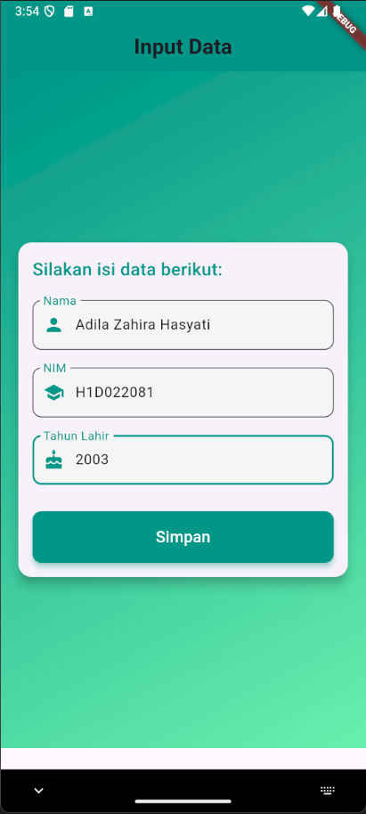
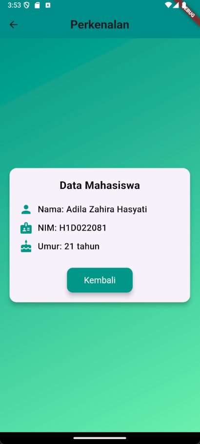

# Tugas Pertemuan 2

Fork dan clone repository ini, lalu jalankan perintah 
```
flutter pub get
```
1. FORM_DATA

### 1. **FormData Class**

`FormData` adalah `StatefulWidget` yang digunakan untuk membuat formulir input data. Di sini kita menggunakan `StatefulWidget` karena form ini melibatkan interaksi pengguna yang bisa mengubah state aplikasi.

#### `FormDataState` Class

Ini adalah state dari `FormData`, di mana semua logika dan widget UI terkait dengan form diimplementasikan.

- **TextEditingController**:
  - `_namaController`, `_nimController`, `_tahunController`: Controller ini digunakan untuk mengelola dan mendapatkan nilai dari `TextField` masing-masing.

- **build() Method**:
  - Mengembalikan `Scaffold` yang merupakan struktur dasar dari layout aplikasi Flutter.
  - `appBar`: Menampilkan bar di bagian atas dengan judul "Input Data". 
  - `body`: Menggunakan `Container` dengan latar belakang gradasi warna hijau dan teal. Ini berisi:
    - `SingleChildScrollView`: Memungkinkan scroll jika konten lebih besar dari layar.
    - `Card`: Menyediakan tampilan kartu yang memiliki sudut membulat dan bayangan.
    - `Column`: Menyusun widget `TextField` dan tombol dalam urutan vertikal.

#### `TextField` Widgets

- **_textboxNama()**, **_textboxNIM()**, **_textboxTahun()**:
  - Masing-masing `TextField` diatur dengan dekorasi khusus, termasuk label, ikon, dan batas yang ditingkatkan saat fokus. Warna `fillColor` diatur untuk memberikan latar belakang abu-abu terang di dalam field.

- **_tombolSimpan()**:
  - Membuat `ElevatedButton` yang memiliki lebar penuh. Ketika tombol diklik, nilai dari `TextEditingController` dibaca, dikonversi ke tipe yang sesuai (misalnya, `int` untuk tahun), dan kemudian data dikirim ke halaman `TampilData` menggunakan `Navigator.push`.

### 2. **TampilData Class**

`TampilData` adalah `StatelessWidget` yang menampilkan data yang dimasukkan pada form sebelumnya.

- **Constructor**:
  - Menerima parameter `nama`, `nim`, dan `tahun`, yang digunakan untuk menampilkan data.

- **build() Method**:
  - Mengembalikan `Scaffold` dengan `AppBar` dan `body`.
  - `body`: 
    - `Container` dengan latar belakang gradasi hijau dan teal.
    - `Card` di tengah halaman dengan padding yang memuat data mahasiswa.
    - `Column` yang menampilkan teks untuk nama, NIM, dan umur, serta tombol "Kembali".

#### **_buildInfoRow() Method**:
- Digunakan untuk membangun baris yang menampilkan informasi dengan ikon di sebelah kiri dan teks informasi di sebelah kanan.

#### **_buildButton() Method**:
- Menghasilkan tombol "Kembali" yang mengembalikan pengguna ke halaman sebelumnya ketika ditekan. 

### Ringkasan Proses:

1. **Pengguna membuka FormData**: Mereka melihat form dengan tiga `TextField` untuk memasukkan nama, NIM, dan tahun lahir.
2. **Pengguna memasukkan data dan menekan tombol "Simpan"**: Data dikumpulkan dari `TextEditingController` dan halaman `TampilData` ditampilkan dengan informasi yang dimasukkan.
3. **Halaman `TampilData`**: Menampilkan data yang dimasukkan dalam format yang telah ditentukan, termasuk umur yang dihitung berdasarkan tahun lahir.
4. **Pengguna menekan tombol "Kembali"**: Mereka kembali ke halaman formulir.


2. TAMPIL_DATA

### 1. **TampilData Class**

`TampilData` adalah sebuah `StatelessWidget` yang digunakan untuk menampilkan data mahasiswa. 

#### Constructor

- `nama`, `nim`, `tahun`: Parameter yang diterima untuk menampilkan data mahasiswa.

#### `build()` Method

- **Scaffold**: Struktur dasar layar dengan `AppBar` dan `body`.

  - **AppBar**: Menampilkan bar di bagian atas dengan judul "Perkenalan".
    - `title`: Menampilkan teks dengan ukuran 24, font bold, dan warna default.
    - `backgroundColor`: Menetapkan warna latar belakang AppBar ke teal.
    - `centerTitle`: Menyusun judul di tengah.
    - `elevation`: Menambahkan bayangan ke AppBar dengan elevasi 5.

  - **body**:
    - **Container**: Menggunakan `BoxDecoration` dengan gradasi warna hijau dari teal ke greenAccent sebagai latar belakang.
    - **Padding**: Menambahkan padding di sekitar konten.
    - **Center**: Memusatkan konten anaknya.
    - **Card**: Menyediakan tampilan kartu yang membungkus data mahasiswa dengan sudut membulat dan bayangan.
      - **Column**: Menyusun elemen-elemen vertikal dalam kartu.
        - **Text**: Menampilkan judul "Data Mahasiswa" dengan ukuran font 22, font bold, dan warna hitam.
        - **SizedBox**: Menambahkan jarak vertikal antara elemen.
        - **_buildInfoRow()**: Metode yang digunakan untuk menampilkan setiap baris informasi dengan ikon dan teks.
        - **_buildButton()**: Metode yang menghasilkan tombol "Kembali" yang memungkinkan pengguna untuk kembali ke layar sebelumnya.

#### `_buildInfoRow()` Method

- **Row**: Mengatur ikon dan teks dalam baris horizontal.
  - **Icon**: Menampilkan ikon dengan warna teal dan ukuran 28.
  - **SizedBox**: Menyediakan jarak horizontal antara ikon dan teks.
  - **Expanded**: Memungkinkan teks untuk menggunakan ruang yang tersisa dalam baris.
  - **Text**: Menampilkan label dan data dengan font size 18, font weight w500, dan warna hitam.

#### `_buildButton()` Method

- **ElevatedButton**: Tombol yang memberikan feedback visual saat ditekan.
  - **onPressed**: Menentukan aksi yang terjadi saat tombol ditekan, yaitu kembali ke layar sebelumnya dengan `Navigator.of(context).pop()`.
  - **style**: Menetapkan gaya tombol dengan padding, warna latar belakang teal, bentuk dengan sudut membulat, bayangan dengan elevasi 8, dan ukuran font 18 untuk teks.
  - **Text**: Menampilkan teks "Kembali" dengan warna putih.

### Ringkasan

1. **Halaman `TampilData`**: Menampilkan data mahasiswa yang meliputi nama, NIM, dan umur.
2. **Informasi Ditempatkan dalam Baris**: Setiap informasi (nama, NIM, umur) ditampilkan dengan ikon terkait di sebelah kiri dan teks di sebelah kanan.
3. **Tombol "Kembali"**: Mengembalikan pengguna ke layar sebelumnya ketika ditekan.

Desain ini menekankan kesederhanaan dengan latar belakang gradasi dan tampilan yang bersih, sambil memberikan feedback visual yang konsisten untuk elemen UI.

Nama : Adila Zahira Hasyati

NIM : H1D022081

Shift Baru: C

## Screenshot
Contoh :


